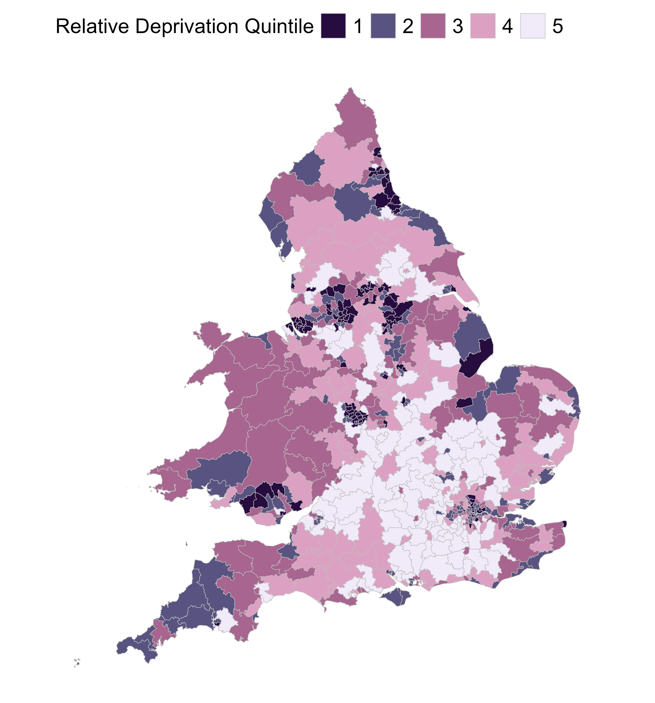

```{r setup, include=FALSE}
#| out-width: "60%"
knitr::opts_chunk$set(echo=FALSE, warning=FALSE, message=FALSE, out.width="60%")
library(ggplot2)

# ── Helper: display a saved plot with an optional caption ─────────────────────
# Usage: show_plot("plots/paper_plots/my_figure.png", "Caption text here")
show_plot <- function(path, caption = NULL) {
  knitr::include_graphics(path)
}

# ── Helper: embed a saved interactive HTML widget ─────────────────────────────
# Usage: show_widget("plots/interactive/my_widget.html")
# To CREATE an interactive widget from a ggplot object p, run in R:
#   htmlwidgets::saveWidget(plotly::ggplotly(p),
#     "plots/interactive/my_widget.html", selfcontained = TRUE)
show_widget <- function(path) {
  htmltools::includeHTML(path)
}
```

```{=html}
<!-- ══════════════════════════════════════════════════════════════
     HERO — editorial typographic, no banner gradient
     ══════════════════════════════════════════════════════════════ -->
```

:::::: hero-banner
::: hero-dateline
KMS Prize Interview · 9th June 2026
:::

# Will heat pumps lead to widening Air Quality inequality in the UK?

::: hero-deck
Modelling 197 kilotonnes of potential NOx savings to 2050 shows that current policy risks concentrating benefits in the least-polluted, least-deprived constituencies — with a **77% gap** in cumulative savings between the cleanest and most-polluted areas.
:::

::: hero-byline
Lucy Webster · Wolfson Atmospheric Chemistry Laboratories, University of York · *Manuscript in preparation, 2026*
:::
::::::

```{=html}
<!-- ══════════════════════════════════════════════════════════════
     ACT 1 — THE CONTEXT
     ══════════════════════════════════════════════════════════════ -->
```

::: part-header
**Introduction: The growing problem of domestic combustion**
:::

::::::: cr-section
The UK has cut carbon emissions by 43% since 1990. But domestic heating — the gas boiler in 23 million British homes — has barely moved. In 2025 it accounts for **14.5% of all greenhouse gas emissions**, the second largest source after transport. Unlike road transport and power generation, the political and technical pathway to net zero for domestic heating is still in its infancy. @cr-context-1

:::: {#cr-context-1}
```{r context-1}
#| out-width: "60%"
#| fig-cap: "Cumulative Heat Pump Installations. Source: Climate Change Committee, Seventh Carbon Budget (2025)"
# ── Replace with your saved plot ─────────────────────────────────────────────
# Suggested file: plots/misc_plots/baseline_nox_inequality.png
#   OR create a sector GHG chart and save it.
# Example ggsave call in your script:
#   ggsave("plots/paper_plots/ghg_by_sector.png", p_ghg, width=8, height=5, dpi=300)

# Uncomment and adjust path once your file exists:
# show_plot("plots/paper_plots/ghg_by_sector.png")

# ── Placeholder (remove once your plot is in place) ──────────────────────────
knitr::include_graphics("plots/paper_plots/ccc_projections.png")
```

::: chart-caption
NOx concentration quintiles across England & Wales constituencies (darker = more polluted). Source: DEFRA 2024 modelled background data.
:::
::::

While road transport NOx has fallen **85%** since 1990 and power generation by **92%**, domestic heating has reduced by only **34%**. Its relative share of the NOx budget is growing. And unlike power stations or motorways, boilers sit inside urban neighbourhoods — directly next to the people breathing their emissions. @cr-nox-share

::: {#cr-nox-share}
```{r nox-share}
#| out-width: "60%"
#| fig-cap: "NOx reductions by sector, 1990–2024. Source: NAEI 2026"
# ── Replace with your saved sector NOx trend plot ────────────────────────────
# Suggested: create and save a bar chart showing % NOx reduction by sector
# Example:
#   ggsave("plots/paper_plots/nox_reduction_by_sector.png", p_nox_sectors, dpi=300)

# Uncomment once ready:
# show_plot("plots/paper_plots/nox_reduction_by_sector.png")

# ── Placeholder ──────────────────────────────────────────────────────────────
knitr::include_graphics("plots/paper_plots/nox_by_pc.png")
```
:::

And already, deprived areas breathe worse air. When we compare NOx concentration quintiles against deprivation quintiles, the most deprived 20% of constituencies are heavily concentrated in the highest pollution bands. **4.5 million people** in the most deprived group live in the most-polluted fifth of constituencies. This co-variation means air quality improvements from heat pumps are an equity issue from the start. @cr-nox-dep

::: {#cr-nox-dep}
```{r nox-dep}
#| out-width: "60%"
#| fig-cap: "Population distribution across NOx concentration and deprivation quintiles."
# ── Replace with: plots/paper_plots/nox_quintile_to_deprivation.png ──────────
# This is saved from mapping_nox_quintile_to_dep.R

show_plot("plots/paper_plots/nox_quintile_to_deprivation.png")
```
:::
:::::::

:::::: three-col
::: col-left
```{r}
#| out-width: "100%"
show_plot("plots/paper_plots/nox_quintile_map.png")
```
:::

::: col-middle
First paragraph of scrolling text. This sits between the two fixed plots and scrolls normally as the reader moves down.

Second paragraph. The plots on either side stay pinned while this text moves.

Third paragraph with a key finding highlighted.
:::

::: col-right
```{r}
#| out-width: "100%"
show_plot("plots/paper_plots/dep_quintile_map.png")
```
:::
::::::

```{=html}
<!-- ══════════════════════════════════════════════════════════════
     ACT 2 — WHERE ARE HEAT PUMPS GOING?
     ══════════════════════════════════════════════════════════════ -->
```

::: part-header
**Who is getting heat pumps right now?**
:::

::::::: cr-section
Two government schemes are driving most installations. The **Boiler Upgrade Scheme (BUS)** offers grants up to £7,500 with no means-testing. The **Energy Company Obligation (ECO4)** is means-tested — aimed at lower-income households. Between May 2022 and March 2026: 79,000 BUS installations, 36,000 ECO installations. The geographic distributions of these two schemes could not be more different. @cr-bus-map

:::: {#cr-bus-map}
```{r bus-map}
#| out-width: "60%"
#| fig-cap: "BUS heat pump installations per 10,000 people by constituency. Source: DESNZ 2026, Fig S4"
# ── Replace with your BUS map ────────────────────────────────────────────────
# This should be saved from your data cleaning / mapping script.
# Suggested: plots/paper_plots/bus_map.png  OR  plots/misc_plots/bus_map.png
# Example save:
#   ggsave("plots/paper_plots/bus_map.png", p_bus_map, width=6, height=8, dpi=300)

# Uncomment once ready:
# show_plot("plots/paper_plots/bus_map.png")

# ── Placeholder ──────────────────────────────────────────────────────────────

```

::: chart-caption
Deprivation quintile map shown as placeholder — replace with BUS installations map (Fig S4).
:::
::::

When we plot heat pumps per capita against ambient NOx concentration in each constituency, an uncomfortable pattern appears: **higher pollution areas have fewer heat pumps per person.** St Ives (Southwest England): 77 heat pumps per 10,000 people, mean NOx 8 µg m⁻³. Liverpool Riverside: 0.6 heat pumps per 10,000 people, mean NOx 38 µg m⁻³. This is **Figure 2** — the core observational finding of the paper. @cr-scatter

::: {#cr-scatter}
```{r scatter}
#| out-width: "60%"
#| fig-cap: "Heat pumps per 10,000 people vs. annual mean modelled NOx concentration (µg m⁻³). Note log x-axis. Source: Fig 2, Webster et al."
# ── This is your key Figure 2 ────────────────────────────────────────────────
# Saved from 6_2050_data_versus_imd_and_nox_conc.R as:
#   plots/paper_plots/nox_by_pc.png

# INTERACTIVE VERSION (recommended for prize interview):
# Run this once in R to create an interactive version:
#   p_scatter <- ggplot(...) + ...   # your existing ggplot object
#   htmlwidgets::saveWidget(
#     plotly::ggplotly(p_scatter, tooltip = c("text", "x", "y")),
#     "plots/interactive/nox_by_pc.html", selfcontained = TRUE
#   )
# Then uncomment:
# show_widget("plots/interactive/nox_by_pc.html")

# Static version (uncomment when ready):
show_plot("plots/paper_plots/nox_by_pc.png")
```
:::

Wales tells a different story. Through ECO4's local authority 'Flex' pathway, Wales achieves **53 installations per 10,000 people**, compared to England's **3.4**. The Flex mechanism allows councils to refer households based on income, vulnerability, or health criteria — actively identifying who needs help rather than waiting for them to apply. This is evidence that the right delivery mechanism exists. It just needs to be scaled up. @cr-maps-comparison

::: {#cr-maps-comparison}
```{r maps-comparison}
#| out-width: "60%"
#| fig-cap: "NOx concentration (left) and deprivation (right) quintile maps. Areas in deepest red/orange are most polluted / most deprived. Source: DEFRA 2024; Abel et al. 2016 / MySociety"
# ── Side-by-side maps ────────────────────────────────────────────────────────
# Replace with a combined/side-by-side map if you have one, or use patchwork
# Files:
#   plots/paper_plots/nox_quintile_map.png
#   plots/paper_plots/dep_quintile_map.png

# Example using patchwork to combine:
#   p_combined <- p_nox_map + p_dep_map
#   ggsave("plots/paper_plots/combined_maps.png", p_combined, width=12, height=7, dpi=300)
# show_plot("plots/paper_plots/combined_maps.png")

# For now, show the NOx map:
show_plot("plots/paper_plots/nox_quintile_map.png")
```
:::
:::::::

```{=html}
<!-- ══════════════════════════════════════════════════════════════
     ACT 3 — THE MODEL AND RESULTS
     ══════════════════════════════════════════════════════════════ -->
```

::: part-header
**Projecting to 2050**
:::

::::::: cr-section
Using the Climate Change Committee's 7th Carbon Budget projections, I built a probabilistic model that allocates projected heat pump installations to each of the 575 English and Welsh constituencies annually from 2025 to 2050. The model runs **10,000 times** to capture stochastic uncertainty. Two scenarios differ only in *where* the heat pumps go — the total is identical. @cr-scenario-card

::: {#cr-scenario-card}
```{r scenario-card, fig.height=3, fig.width=7}
#| out-width: "60%"
# Simple infographic — easier to keep as generated R than a saved PNG
library(ggplot2)
df <- data.frame(
  x = c(1, 3), y = c(1, 1),
  label = c("Current trends\ncontinue", "Suitability-driven\nuptake"),
  sub   = c("Weighted by present-day\nBUS + ECO uptake patterns",
            "Weighted by Nesta's housing\nsuitability index"),
  col   = c("#C45E2A", "#2E5E4E")
)
ggplot(df, aes(x=x, y=y)) +
  geom_tile(aes(fill=col), width=1.5, height=0.7, colour="white", linewidth=2) +
  geom_text(aes(label=label, colour=col), y=1.15, fontface="bold", size=4.5, vjust=0) +
  geom_text(aes(label=sub), colour="white", y=0.9, size=3, lineheight=1.2, vjust=1) +
  scale_fill_identity() + scale_colour_identity() +
  scale_y_continuous(limits=c(0.55, 1.5)) +
  scale_x_continuous(limits=c(0.2, 3.8)) +
  labs(title="Two scenarios — same number of heat pumps, different geography") +
  theme_void() +
  theme(plot.title=element_text(face="bold", size=12, hjust=0.5, margin=margin(b=8)))
```
:::

Here is what happens to heat pump installations over time, split by how polluted each area is. Under **current trends**, less-polluted constituencies (Q1) accelerate rapidly, peaking nearly a decade before the most-polluted areas (Q5). Under **suitability-driven** deployment the profiles are broadly similar. Time matters here — every year of delay in the most-polluted areas is a year of foregone health benefit. @cr-installs-time

::: {#cr-installs-time}
```{r installs-time}
#| out-width: "60%"
#| fig-cap: "Annual heat pump installations (thousands) by NOx concentration quintile. Q1 = least polluted; Q5 = most polluted. Source: Fig 3a, Webster et al."
# ── This is Figure 3a ─────────────────────────────────────────────────────────
# Saved from 6_2050_data_versus_imd_and_nox_conc.R as:
#   plots/paper_plots/nox_savings_vs_nox_conc_quintile.png  (static)
#   OR plots/paper_plots/nox_savings_vs_nox_conc_quintile_pct.png  (% version)

# INTERACTIVE VERSION (recommended):
#   htmlwidgets::saveWidget(
#     plotly::ggplotly(p_nox_quintile),
#     "plots/interactive/nox_savings_vs_nox_conc_quintile.html",
#     selfcontained = TRUE
#   )
# show_widget("plots/interactive/nox_savings_vs_nox_conc_quintile.html")

show_plot("plots/paper_plots/nox_savings_vs_nox_conc_quintile.png")
```
:::

By 2050, the cumulative picture is stark. Under current trends: **51.6 kilotonnes** of NOx savings in the least-polluted 20% of constituencies, versus **29.2 kt** in the most-polluted. That is a **77% gap**. Under suitability-driven deployment, this narrows to just 19%. The same total number of heat pumps. A completely different distribution of who breathes cleaner air. @cr-cumulative-nox

::: {#cr-cumulative-nox}
```{r cumulative-nox}
#| out-width: "60%"
#| fig-cap: "Cumulative NOx savings (kilotonnes) by NOx quintile and scenario. Source: Fig 3b, Webster et al."
# ── Figure 3b ─────────────────────────────────────────────────────────────────
# The combined figure (3a + 3b + 3c) may be saved as:
#   plots/paper_plots/nox_savings_vs_nox_conc_quintile.png
# Or there may be a separate cumulative savings plot.

# INTERACTIVE VERSION:
#   htmlwidgets::saveWidget(
#     plotly::ggplotly(p_cumulative_nox),
#     "plots/interactive/cumulative_nox_by_quintile.html",
#     selfcontained = TRUE
#   )
# show_widget("plots/interactive/cumulative_nox_by_quintile.html")

show_plot("plots/paper_plots/nox_savings_vs_nox_conc_quintile.png")
```
:::

The same pattern holds by **deprivation**. Under current policy, the least-deprived areas accumulate **42% more** NOx savings than the most-deprived. The suitability-driven scenario narrows — but does not eliminate — this gap. Critically, the most-deprived communities would gain £197 million more in avoided damage costs under the better scenario. Equity and economic efficiency point in the same direction. @cr-imd-results

::: {#cr-imd-results}
```{r imd-results}
#| out-width: "60%"
#| fig-cap: "Heat pump installations, NOx savings and damage costs by deprivation quintile. Source: Fig 4, Webster et al."
# ── Figure 4 ──────────────────────────────────────────────────────────────────
# Saved as:
#   plots/paper_plots/nox_savings_vs_imd.png
#   OR plots/paper_plots/nox_savings_vs_imd_percentage.png

# INTERACTIVE VERSION:
#   htmlwidgets::saveWidget(
#     plotly::ggplotly(p_imd),
#     "plots/interactive/nox_savings_vs_imd.html",
#     selfcontained = TRUE
#   )
# show_widget("plots/interactive/nox_savings_vs_imd.html")

show_plot("plots/paper_plots/nox_savings_vs_imd.png")
```
:::
:::::::

```{=html}
<!-- ══════════════════════════════════════════════════════════════
     ACT 4 — LOCK-IN AND THE INEQUALITY TRAJECTORY
     ══════════════════════════════════════════════════════════════ -->
```

::: part-header
**The Risk of inequality lock in and the CCC gap**
:::

::::::: cr-section
### Heat pumps are not like electric vehicles

An EV can drive anywhere. A heat pump is **permanently fixed** to one address. Early adopters accumulate compounding clean-air benefits year after year — their heating emissions drop to zero and stay there. Those who don't get one early are locked out of those benefits indefinitely. The geography of installation is not a side-effect of the policy. It *is* the policy. @cr-inequality-fig

::: {#cr-inequality-fig}
```{r inequality-fig}
#| out-width: "60%"
#| fig-cap: "Projected absolute and relative NOx emissions inequality (Q1 vs Q5 deprived constituencies) under two scenarios. Source: Fig 5, Webster et al."
# ── Figure 5 — the inequality trajectory ─────────────────────────────────────
# Saved as:
#   plots/paper_plots/inequality_figure.png
#   OR plots/paper_plots/absolute_and_rel_inequality.png
#   OR plots/paper_plots/absolute_and_rel_inequality_two_scenarios.png

# INTERACTIVE VERSION (highly recommended for this chart):
#   htmlwidgets::saveWidget(
#     plotly::ggplotly(p_inequality),
#     "plots/interactive/inequality_figure.html",
#     selfcontained = TRUE
#   )
# show_widget("plots/interactive/inequality_figure.html")

show_plot("plots/paper_plots/absolute_and_rel_inequality_two_scenarios.png")
```
:::

Under **current policy**, relative inequality in NOx emissions intensity *worsens* for **12 years** before any improvement begins. It takes until **2046** for relative inequality to return to 2025 levels. The suitability-driven scenario avoids this entirely, with a steady moderate improvement throughout. The difference is not a technicality — it is 12 years of disproportionate harm to communities that already face the greatest pollution burden. @cr-future-projections

::: {#cr-future-projections}
```{r future-projections}
#| out-width: "60%"
#| fig-cap: "Projected NOx emissions from non-industrial combustion by deprivation quintile, 2025–2050. Source: Fig 5, Webster et al."
# ── Figure 5A/B panels ────────────────────────────────────────────────────────
# Saved as:
#   plots/misc_plots/future_nox_projections.png
#   OR plots/misc_plots/emissions_inequality_trends.png
#   OR plots/misc_plots/future_nox_pct_reduction.png

# INTERACTIVE VERSION:
#   htmlwidgets::saveWidget(
#     plotly::ggplotly(p_projections),
#     "plots/interactive/future_nox_projections.html",
#     selfcontained = TRUE
#   )
# show_widget("plots/interactive/future_nox_projections.html")

show_plot("plots/misc_plots/future_nox_projections.png")
```
:::

### We are already behind

This analysis assumes the UK *achieves* CCC targets. By 2025, cumulative UK heat pump installations stood at approximately **337,000** — against a 7th Carbon Budget target of 400,000, and a 6th Carbon Budget expectation of **1,000,000**. If deployment continues to underperform, the relative inequality never resolves. Communities locked out early are simply locked out permanently. @cr-ccc-gap

:::: {#cr-ccc-gap}
```{r ccc-gap}
#| out-width: "60%"
#| fig-cap: "Cumulative UK heat pump installations (MCS data) vs. CCC 6th and 7th Carbon Budget projections. Source: Fig 6, Webster et al.; MCS 2026; CCC 2020, 2025"
# ── Figure 6 ──────────────────────────────────────────────────────────────────
# This is the MCS vs CCC projection comparison.
# Save from your script that creates this comparison:
#   ggsave("plots/paper_plots/ccc_vs_actual.png", p_ccc_gap, width=9, height=5, dpi=300)

# INTERACTIVE VERSION:
#   htmlwidgets::saveWidget(
#     plotly::ggplotly(p_ccc_gap),
#     "plots/interactive/ccc_vs_actual.html",
#     selfcontained = TRUE
#   )
# show_widget("plots/interactive/ccc_vs_actual.html")

# Placeholder — replace with your CCC gap figure:
show_plot("plots/misc_plots/cumulative_nox_emissions.png")
```

::: chart-caption
Replace with your Fig 6 (CCC target vs actual installations comparison).
:::
::::
:::::::

```{=html}
<!-- ══════════════════════════════════════════════════════════════
     ACT 5 — POLICY AND CONCLUSIONS
     ══════════════════════════════════════════════════════════════ -->
```

::: part-header
**Act 5 · 9:00–10:00**   What needs to change
:::

:::: cr-section
Three recommendations follow directly from this analysis. They do not require abandoning the existing schemes — they require redesigning them to treat heat pump deployment as the **air quality intervention** it is. @cr-recs

::: {#cr-recs}
```{r recs, fig.height=5.5, fig.width=6.5}
#| out-width: "60%"
# Policy recommendations — simple generated graphic, no saved file needed
recs <- data.frame(
  n    = 1:3,
  head = c("Designate heat pump\npriority areas",
           "Target social housing\nduring boiler replacement",
           "Scale up active local\nauthority delivery"),
  body = c("Like smoke control zones: designate\nareas based on combined NOx,\ndeprivation and housing suitability.",
           "Bulk procurement in social housing\nreaches most-deprived households\nand delivers supply-chain savings.",
           "ECO4 Flex in Wales delivers 15× more\nthan England per capita. Active\nidentification and referral works."),
  col  = c("#C45E2A", "#2E5E4E", "#2166AC")
)
ggplot(recs) +
  geom_rect(aes(xmin=0, xmax=10, ymin=-0.28, ymax=0.28, fill=col),
            colour="white", linewidth=1.5) +
  geom_text(aes(x=0.6, y=0.0, label=as.character(n)), colour="white",
            fontface="bold", size=9, hjust=0.5) +
  geom_text(aes(x=2.0, y=0.1, label=head), colour="white",
            fontface="bold", size=3.8, hjust=0, lineheight=1.1, vjust=1) +
  geom_text(aes(x=2.0, y=-0.05, label=body), colour="white",
            size=3.1, hjust=0, lineheight=1.2, vjust=1) +
  scale_fill_identity() +
  facet_wrap(~n, ncol=1) +
  scale_x_continuous(limits=c(0,11.5)) +
  scale_y_continuous(limits=c(-0.38,0.38)) +
  labs(title="Three policy recommendations") +
  theme_void() +
  theme(plot.title=element_text(face="bold",size=14,hjust=0.5,margin=margin(b=12)),
        strip.text=element_blank())
```
:::
::::

```{=html}
<!-- ══════════════════════════════════════════════════════════════
     CLOSING
     ══════════════════════════════════════════════════════════════ -->
```

:::: closing-banner
## TLDR...

Geographic distribution of heat pump installations under current UK policy schemes risks compounding existing inequalities in air pollution exposure. Modelling installations to 2050 shows that under current policies there would be cumulative NO$_x$ emission savings that are 77% greater in the least polluted areas compared to the most, and 42% greater in the least deprived areas compared to the most deprived. A suitability-driven deployment scenario narrows, but does not eliminate, such inequalities.

**Lucy Webster** · University of York · `ljw580@york.ac.uk`

[Paper in preparation · GitHub: <https://github.com/lucy-web-0812/heat_pumps_AQ>]{style="font-family: 'DM Sans', sans-serif; font-size: 0.8rem; color: #5C5C5C;"}

::: {style="margin-top:1.5rem; font-family: 'DM Sans', sans-serif; font-size:0.78rem; color:#5C5C5C; font-style:normal;"}
*Supervisors: Prof Alastair C. Lewis · Dr Sarah J. Moller · University of York*<br> *Funded by NERC PhD programme · National Centre for Atmospheric Science*
:::
::::
