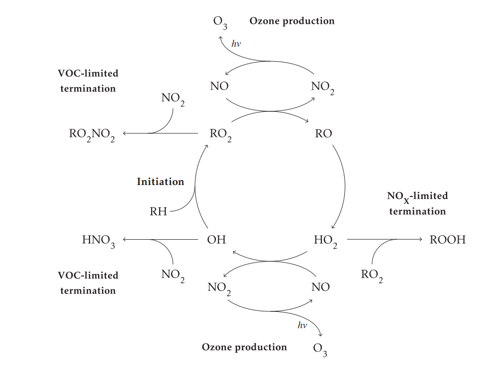
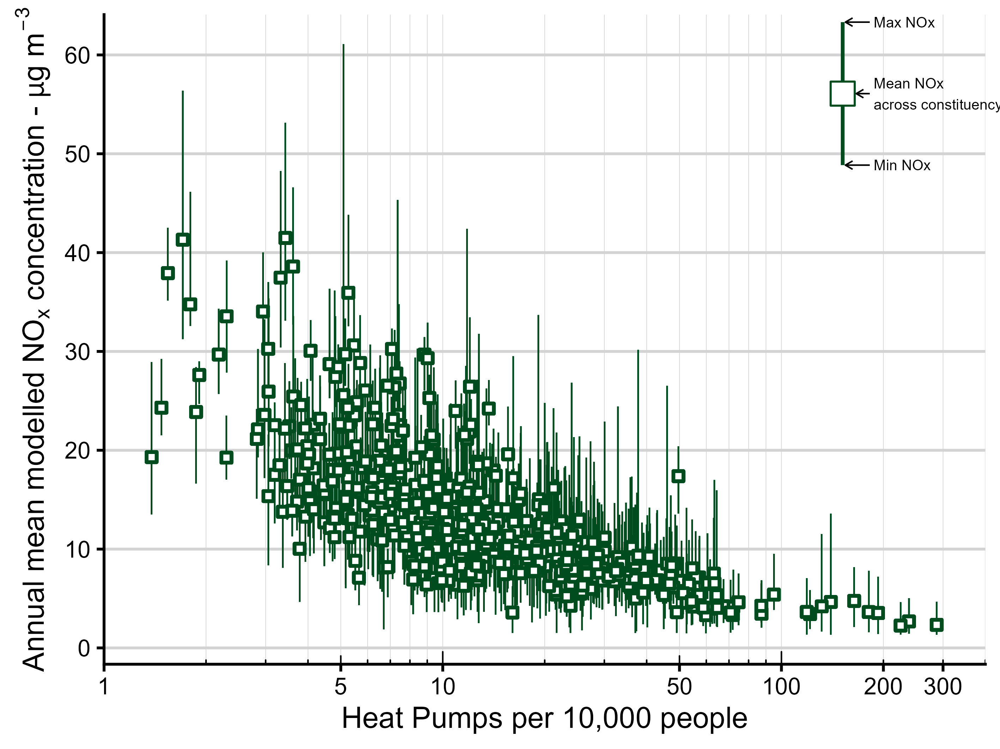
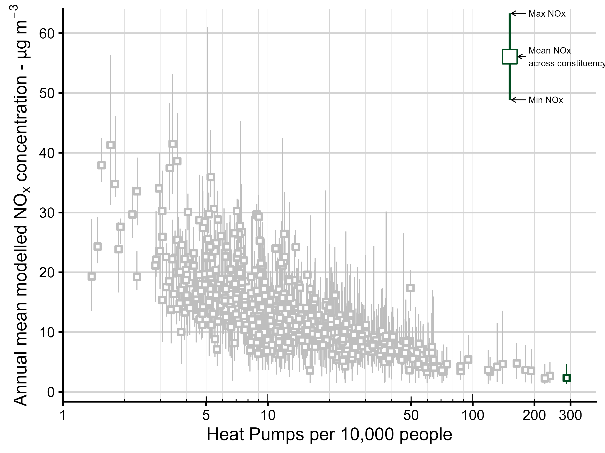
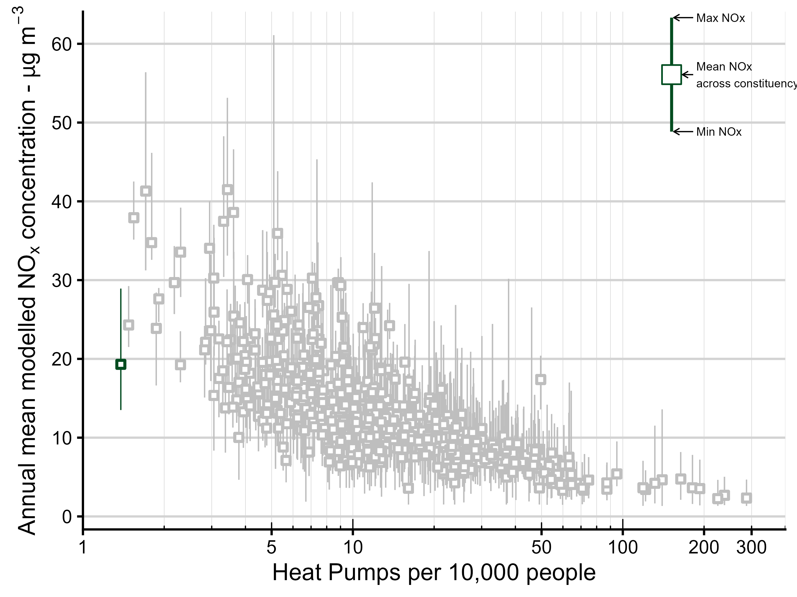

```{r setup, include=FALSE}
#| out-width: "60%"
knitr::opts_chunk$set(echo=FALSE, warning=FALSE, message=FALSE, out.width="60%")
library(ggplot2)

# ── Helper: display a saved plot with an optional caption ─────────────────────
# Usage: show_plot("plots/paper_plots/my_figure.png", "Caption text here")
show_plot <- function(path, caption = NULL) {
  knitr::include_graphics(path)
}

# ── Helper: embed a saved interactive HTML widget ─────────────────────────────
show_widget <- function(path) {
  htmltools::includeHTML(path)
}
```

```{=html}
<!-- ══════════════════════════════════════════════════════════════
     HERO — editorial typographic, no banner gradient
     ══════════════════════════════════════════════════════════════ -->
```

:::::: hero-banner
::: hero-dateline
KMS Prize Interview · 9th June 2026
:::

# Will heat pumps lead to widening air quality disparity in the UK?

::: hero-deck
-   197 kilotonnes of potential NOx savings from installing heat pumps from 2025 to 2050
-   Modelling shows that current policy risks concentrating benefits in the least-polluted, least-deprived constituencies — Potential for a **77% gap** in cumulative savings between the cleanest and most-polluted areas
-   Implications for worsening health inequality
:::

::: hero-byline
Lucy Webster \| WACL, University of York \| *Manuscript in preparation, 2026*
:::
::::::

```{=html}
<!-- ══════════════════════════════════════════════════════════════
     ACT 1 — THE CONTEXT
     ══════════════════════════════════════════════════════════════ -->
```

::: {#introduction-fair-clean-air-for-all .part-header}
### Introduction: Fair, clean air for all?
:::

:::: cr-section
-   **\~43,000** deaths annually from air pollution in the UK¹.
-   Unequal exposure across the population²
-   Fossil fuel boilers dominate heating
-   Combustion emits nitrogen oxides (NO$_x$ - NO$_2$ + NO)

NO2 is harmful but also plays an important role formation of secondary pollutants; The atmospheric chemistry of NO$_x$ is complex and influences both ozone and particulate matter formation. @cr-context-1

::: {#cr-context-1}
```{r context-1}
#| out-width: "75%"
#| fig-cap: "NO$_x$ tropospheric reaction scheme | Source: Wilson (2025)"



```
:::
::::

```{=html}
<!-- ══════════════════════════════════════════════════════════════
     ACT 2 Context
     ══════════════════════════════════════════════════════════════ -->
```

::: part-header
### Where have heat pumps been installed so far?
:::

:::::: cr-section
Government support comes through two schemes: the **Boiler Upgrade Scheme (BUS)** — a £7,500 grant with no means-testing — and **ECO4**, which targets lower-income households. By 2026 these had delivered 79,000 and 36,000 installations respectively. @cr-nox-scatter

Plot this against the annual average NO$_x$ concentration over the constituency. The overall picture shows a clear negative relationship — areas with more heat pumps tend to have lower NO$_x$. @cr-nox-scatter

Ceredigion Preseli, a rural constituency in Wales, has the most heat pumps per capita with 287 per 10,000 people. @cr-nox-scatter-ceri

In contrast, there are only 1.4 heat pumps per 10,000 people in Liverpool Riverside. @cr-nox-scatter-lpool

::: {#cr-nox-scatter}
```{r nox-by-pc}
#| out-width: "70%"
#| fig-cap: "Annual mean NOx concentrations compared to heat pump installations per capita | Source: Department for the Environment, Food and Rural Affairs (2026), Department for Energy Security and Net Zero (2026)"


```
:::

::: {#cr-nox-scatter-ceri}
```{r nox-share_high}
#| out-width: "70%"
#| fig-cap: "Annual mean NOx concentrations compared to heat pump installations per capita | Source: Department for the Environment, Food and Rural Affairs (2026), Department for Energy Security and Net Zero (2026)"


```
:::

::: {#cr-nox-scatter-lpool}
```{r nox-share}
#| out-width: "70%"
#| fig-cap: "Annual mean NOx concentrations compared to heat pump installations per capita | Source: Department for the Environment, Food and Rural Affairs (2026), Department for Energy Security and Net Zero (2026)"


```
:::
::::::

```{=html}
<!-- ═══════════════════════════════════════════════════════════
     SECTION 3 — THE MODEL (Methods)
     Place this block between Section 2 (Current situation) and
     Section 4 (Results) in index.qmd
     ═══════════════════════════════════════════════════════════ -->
```

::: part-header
### Where will heat pumps go? — model, data and policy scenarios
:::

<!-- ── 3a: Data overview ─────────────────────────────────────── -->

:::: cr-section
The analysis draws on six spatial datasets, all aggregated to the **575 parliamentary constituencies** of England and Wales (ONS July 2024 boundaries). @cr-data-table

::: {#cr-data-table}
```{r data-table, fig.height=5.5, fig.width=8.5}
#| out-width: "75%"
library(ggplot2)
library(ggtext)

datasets <- data.frame(
  layer = c(
    "BUS + ECO\ninstallations",
    "Nesta heat pump\nsuitability index",
    "DEFRA modelled\nNO<sub>x</sub> concentrations",
    "NAEI non-industrial\ncombustion emissions",
    "IMD composite\ndeprivation index",
    "CCC 7th Carbon\nBudget projections"
  ),
  source = c("DESNZ (2026)","Nesta (2025)","DEFRA (2025)",
             "NAEI (2025)","Abel et al. (2016)","CCC (2025)"),
  role = c("Present day trends continue","Suitability-driven uptake",
           "NOx Quintile stratification","NOx savings baseline",
           "Equity analysis","Total annual installs"),
  cat = c("Policy","Policy","Air quality","Air quality",
          "Equity","Climate"),
  col = c("#DC6BAD","#DC6BAD","#6969B3","#6969B3",
          "#B4CEB3","#7F7B82")
)
ggplot(datasets, aes(y=reorder(layer, -seq_len(nrow(datasets))),
                     x=1, fill=col)) +
  geom_tile(width=1.25, height=0.7, colour="white", linewidth=1.5) +
  geom_richtext(aes(label=layer), size=4.5, hjust=0.5,
                fill=NA, label.colour=NA, colour="white",
                fontface="bold", lineheight=1.1) +
  geom_text(aes(x=1.7, label=source), size=4,
            colour="#5C5C5C", hjust=0) +
  geom_text(aes(x=0.3, label=role), size=4,
            colour="#1A1A1A", hjust=1) +
  scale_fill_identity() +
  scale_x_continuous(limits=c(-0.3, 2.2)) +
  labs(title="The six main input datasets:",
       subtitle="Aggregate to the 575 English & Welsh parliamentary constituencies") +
  theme_void() +
  theme(plot.title=element_text(face="bold",size=18,
                                margin=margin(b=4)),
        plot.subtitle=element_text(colour="#5C5C5C",size=12,
                                   margin=margin(b=10)))
```
:::
::::

<!-- ── 3b: Two scenarios ──────────────────────────────────────── -->

:::: cr-section
Produce a model to allocate the **CCC 7th Carbon Budget Balanced Net Zero** projections — the pathway reflecting effective and feasible decarbonisation options — across constituencies each year from 2025 to 2050. @cr-scenarios-table

Two scenarios explore the consequences of policy choice. The total number of heat pumps installed each year is fixed. The only difference is *where* they go. @cr-scenarios-table


We can do this by asigning each constituency a relative probability of adoption based on either the number of heat pumps installed so far - <span style="color: #7F7B82;">(*Current trends continue*)</span> - or the relative suitability for a heat pump <span style="color: #DC6BAD;">(*Suitability-driven uptake*)</span> @cr-scenarios-table

::: {#cr-scenarios-table}
```{r scenarios-table, fig.height=2.8, fig.width=6.5}
#| out-width: "100%"

library(patchwork)
scen <- data.frame(
  x     = c(1, 3),
  label = c("Current trends \ncontinue", "Suitability-driven \nuptake"),
  basis = c("Combined BUS + ECO\nuptake weights",
            "Nesta heat pump\nsuitability index"),
  interp = c("Deployment shaped by\nexisting grant schemes",
             "Deployment shaped by\nbuilding readiness"),
  col   = c("#7F7B82", "#DC6BAD")
)


img_data <- png::readPNG("plots/paper_plots/ccc_projections.png")
p <- grid::rasterGrob(img_data, interpolate = TRUE)

q <- ggplot(scen, aes(x=x, y=1)) +
  geom_tile(aes(fill=col), width=1.6, height=2,
            colour="white", linewidth=2) +
  geom_text(aes(label=label, colour=col), y=1.22,
            fontface="bold", size=2.5, vjust=0) +
  geom_text(aes(label=basis), colour="black",
            y=1.02, size=2, lineheight=1.2, vjust=1) +
  geom_text(aes(label=interp), y=0.72, size=2,
            colour="black", fontface="italic",
            lineheight=1.2, vjust=1) +
  scale_fill_identity() +
  scale_colour_identity() +
  scale_y_continuous(limits=c(0.4, 1.55)) +
  scale_x_continuous(limits=c(0.1, 3.9)) +
  theme_void() +
  theme(plot.margin=margin(5,5,5,5))


wrap_elements(p) + q
```
:::
::::

<!-- ── 3c: The allocation equation ────────────────────────────── -->

::::: cr-section
Heat pumps are allocated to constituencies each year by drawing from a **multinomial distribution**, with probabilities proportional to each constituency's policy weight and its remaining market capacity. @cr-alloc-eq

:::: {#cr-alloc-eq}
::: model-box
**Allocation formula**

For year $t$, draw $H_t$ installations from:

$$H_{i,t} \;\sim\; \operatorname{Multinomial} \!\bigl(H_t,\;\mathbf{p}_t\bigr)$$

where the probability for constituency $i$ is:

$$p_{i,t} \;=\; \frac{w_i \;\cdot\; \bigl(N_{i,t} - C_{i,t-1}\bigr)^{\!+}}{\displaystyle\sum_{j=1}^{575} w_j \;\cdot\; \bigl(N_{j,t} - C_{j,t-1}\bigr)^{\!+}}$$

| Symbol | Meaning |
|:---------------|:-------------------------------------------------------|
| $H_t$ | National total installations in year $t$ (Climate Change Committee) |
| $w_i$ | Scenario weight — BUS+ECO uptake **or** suitability score |
| $N_{i,t}$ | Projected households in constituency $i$ at year $t$ |
| $C_{i,t-1}$ | Cumulative installations to end of $t-1$ |
| $(\cdot)^+$ | Soft-saturation cap (max 85% household uptake) |
:::
::::
:::::

<!-- ── 3d: NOx savings equation ───────────────────────────────── -->

::::: cr-section
We assume that each heat pump installation displaces a natural gas boiler. The annual NOx saving per installation is derived from the **Eco-Design Directive emission limit** and **Ofgem median gas consumption**: @cr-nox-eq

We can also calculate the **cumulative emissions savings** across a constituency. This really helps to show the benefits that early adopters get. @cr-nox-eq

:::: {#cr-nox-eq}
::: model-box
**NOx saving per installation**

$$\Delta\text{NOx}_{\text{install}} \;=\; \underbrace{56\;\text{mg kWh}^{-1}}_{\substack{\text{Eco-Design}\\\text{limit}}} \;\times\; \underbrace{11{,}500\;\text{kWh yr}^{-1}}_{\substack{\text{median annual}\\\text{gas consumption}}} \;=\; \boxed{644\;\text{g yr}^{-1}}$$

**Constituency-level NO**$_x$ saving in year $t$:

$$\Delta\text{NOx}_{i,t} \;=\; H_{i,t} \;\times\; 644\;\text{g yr}^{-1}$$

**Cumulative saving 2025–2050:**

$$\text{NOx}_i^{\text{saved}} \;=\; \sum_{t=2025}^{2050} \Delta\text{NOx}_{i,t}$$
:::
::::
:::::

<!-- ── 3e: Damage costs ────────────────────────────────────────── -->

::::: cr-section
Avoided damage costs translate the NOx savings into economic terms and is frequently used by policy makers. **Damage cost rates vary by location** — a tonne of NOx avoided in a city is worth more than one avoided in the countryside, because more people breathe the air. @cr-damage-eq

$c_i$ *is derived from UK Treasury Green Book estimates for three geographic categories (London, Urban, Rural) mapped to each constituency via population-weighted rural–urban classification shares.* @cr-damage-eq

:::: {#cr-damage-eq}
::: model-box
**Damage costs avoided, 2025–2050**

$$D_i \;=\; \sum_{t=2025}^{2050} \frac{\Delta\text{NOx}_{i,t} \;\times\; c_i}{(1 + r)^{t - 2025}}$$

| Symbol | Meaning                                             |
|:-------|:----------------------------------------------------|
| $c_i$  | Constituency-specific damage cost (£ per tonne NOx) |
| $r$    | HM Treasury discount rate (−1.5% yr⁻¹)              |


:::
::::
:::::

:::: cr-section
Constituency-level NOx concentrations were derived as **population-weighted means** of DEFRA's 1 km² modelled background grid. The population-weighted median IMD rank was used to assign deprivation quintiles, ensuring each quintile contains roughly equal numbers of residents rather than equal numbers of constituencies: @cr-method-maps

$$\bar{x}_i = \frac{\displaystyle\sum_{j \in i} \, p_j \, x_j}{\displaystyle\sum_{j \in i} \, p_j}$$ where $x_j$ is the value (concentration or IMD score) in grid cell $j$, and $p_j$ is its population.

::: {#cr-method-maps}
```{r map-nox}
#| out-width: "60%"

library(patchwork)

show_plot("plots/paper_plots/nox_quintile_map.png")


# dep_img_data <- png::readPNG("plots/paper_plots/dep_quintile_map.png")
# dep <- grid::rasterGrob(dep_img_data, interpolate = TRUE)
# 
# wrap_elements(nox) + wrap_elements(dep) & theme(plot.background = element_rect(fill='transparent'))

```
:::
::::

```{=html}
<!-- ══════════════════════════════════════════════════════════════
     Results
     ══════════════════════════════════════════════════════════════ -->
```

::: part-header
### Results
:::


:::{.cr-section}

Replacing gas boilers in line with the CCC Balanced Net Zero pathway would deliver a cumulative **197 kilotonnes** of NOx savings across England and Wales by 2050 — roughly 20% of the UK's total annual NOx budget. That is a substantial public health prize. The question is who collects it. @cr-results-total

:::{#cr-results-total}

::: {.stat-block}
::: {.stat-number}
197 kilotonnes
:::
::: {.stat-label}
of NOx abated,

England & Wales, 2025–2050
:::
:::

::: {.stat-block}
::: {.stat-number}
£4.8 Billion 
:::
::: {.stat-label}
Potential damage cost savings  

:::
:::

::: {.stat-block}
::: {.stat-number}
1.9 to 1.7
:::
::: {.stat-label}
Reduction in the ratio of average NOx emissions intensity

most deprived vs least deprived, 2025 and 2050
:::
:::

:::


:::


:::: cr-section
Under **current policy**, annual installations in the least-polluted quintile (Q1) peak at **470,000 by 2034** — a full decade ahead of Q5, where peak installations of 390,000 are not reached until **2044**. This lag means the cleanest areas bank clean-air benefits early, compounding the advantages. @cr-fig3-installs

::: {#cr-fig3-installs}
```{r}

#| out-width: "100%"


library(tidyverse)
library(plotly)

model_names <- c("present_day_scenario" = "Current trends continue",
                    "suitability_probability" = "Suitability-driven uptake" )


model_results_per_pc <- read_csv("data/processed_data/model_results_per_pc.csv")

pc_combined_dataset <- read_csv("data/processed_data/pc_combined_dataset.csv") |> 
  select(-PCON25NM)


nox_savings_per_boiler_per_year <- (0.056 * 11500) / 1000000000 # Convert from grams to kilotonnnes


pc_dep_model_results_all <- model_results_per_pc |> 
  left_join(pc_combined_dataset, join_by(PCON25CD)) |> 
  mutate(median_imd_decile = as.factor(median_imd_decile)) |> 
  mutate(nox_saving = heat_pump_years * nox_savings_per_boiler_per_year) |> # cumulative emissions savings in kilotonnes
  mutate(model_run_label = case_when(
    model_run == "all_three_factors" ~ "BUS, ECO and Suitability", 
    model_run == "BUS_only" ~ "Boiler Upgrade Scheme \n(non-means tested)", 
    model_run == "ECO_only" ~ "Energy Company Obligation\n (means tested)", 
    model_run == "present_day_scenario" ~ "Current trends continue", 
    model_run == "suitability_probability" ~ "Suitability-driven uptake", 
  ))


p <- pc_dep_model_results_all |>
  group_by(nox_conc_quintile, model_run, year) |>
  summarise(
    total_hp_per_quintile = sum(heat_pump_number),
    total_hp_lower = sum(heat_pump_number_lower_bound),
    total_hp_upper = sum(heat_pump_number_upper_bound)
  ) |>
  ungroup() |>
  filter(model_run %in% c("suitability_probability", "present_day_scenario")) |>
  filter(nox_conc_quintile %in% c("1", "5")) |>
  mutate(
    nox_conc_quintile = factor(
      nox_conc_quintile,
      levels = c("1", "5"),
      labels = c("Least polluted", "Most polluted")
    ), 
    tooltip = paste0(
      "Year: ", format(year, "%Y"),
      "<br>Group: ", nox_conc_quintile,
      "<br>Installations: ", round(total_hp_per_quintile / 1000, 1), " thousand"
    )
  ) |> 
  ggplot() +
  geom_line(
    aes(
      x = year,
      y = total_hp_per_quintile / 1000,
      colour = nox_conc_quintile, 
      group = nox_conc_quintile,
      text = tooltip
    ), 
    linewidth = 1.2
  ) +
  scale_colour_manual(
    name = "NOx Concentration Quintile",
    values = c("#607345FF", "#6C568CFF"),
    labels = c(`1` = "1 Least polluted", `5` = "5 - Most polluted")
  ) +
  scale_fill_manual(
    name = "NOx Concentration Quintile",
    values = c("#607345FF", "#6C568CFF"),
    labels = c(`1` = "1 Least polluted", `5` = "5 - Most polluted")
  ) +
  scale_x_datetime(name = "Year", limits = c(as.POSIXct("2020-01-01"), NA)) +
  scale_y_continuous(name = "Heat pump installations (thousands)",
                     expand = c(0, 0),
                     limits = c(0, 500)) +
  facet_wrap( ~ model_run, labeller = as_labeller(model_names)) +
  theme_minimal(12) +
  theme(legend.position = "top", axis.line = element_line())


ggplotly(p, tooltip = "text")

```

:::

Under **current policy**, annual installations in the least-polluted quintile (Q1) peak at **470,000 by 2034** — a full decade ahead of Q5, where peak installations of 390,000 are not reached until **2044**. This lag means the cleanest areas bank clean-air benefits early, compounding the advantages. @cr-fig3-nox-savings

::: {#cr-fig3-nox-savings}
```{r}

#| out-width: "100%"


library(tidyverse)
library(plotly)

model_names <- c("present_day_scenario" = "Current trends continue",
                    "suitability_probability" = "Suitability-driven uptake" )


model_results_per_pc <- read_csv("data/processed_data/model_results_per_pc.csv")

pc_combined_dataset <- read_csv("data/processed_data/pc_combined_dataset.csv") |> 
  select(-PCON25NM)


nox_savings_per_boiler_per_year <- (0.056 * 11500) / 1000000000 # Convert from grams to kilotonnnes


pc_dep_model_results_all <- model_results_per_pc |> 
  left_join(pc_combined_dataset, join_by(PCON25CD)) |> 
  mutate(median_imd_decile = as.factor(median_imd_decile)) |> 
  mutate(nox_saving = heat_pump_years * nox_savings_per_boiler_per_year) |> # cumulative emissions savings in kilotonnes
  mutate(model_run_label = case_when(
    model_run == "all_three_factors" ~ "BUS, ECO and Suitability", 
    model_run == "BUS_only" ~ "Boiler Upgrade Scheme \n(non-means tested)", 
    model_run == "ECO_only" ~ "Energy Company Obligation\n (means tested)", 
    model_run == "present_day_scenario" ~ "Current trends continue", 
    model_run == "suitability_probability" ~ "Suitability-driven uptake", 
  ))


q <- pc_dep_model_results_all |>
  group_by(nox_conc_quintile, model_run, year) |>
  summarise(
    total_nox_per_quintile = sum(nox_saving),
  ) |>
  ungroup() |>
  filter(model_run %in% c("suitability_probability", "present_day_scenario")) |>
  filter(nox_conc_quintile %in% c("1", "5")) |>
  mutate(
    nox_conc_quintile = factor(
      nox_conc_quintile,
      levels = c("1", "5"),
      labels = c("Least polluted", "Most polluted")
    ), 
    tooltip = paste0(
      "Year: ", format(year, "%Y"),
      "<br>Group: ", nox_conc_quintile,
      "<br>Installations: ", round(total_nox_per_quintile / 1000, 1), " thousand"
    )
  ) |> 
  ggplot() +
  geom_line(
    aes(
      x = year,
      y = total_nox_per_quintile / 1000,
      colour = nox_conc_quintile, 
      group = nox_conc_quintile,
      text = tooltip
    ), 
    linewidth = 1.2
  ) +
  scale_colour_manual(
    name = "NOx Concentration Quintile",
    values = c("#607345FF", "#6C568CFF"),
    labels = c(`1` = "1 Least polluted", `5` = "5 - Most polluted")
  ) +
  scale_fill_manual(
    name = "NOx Concentration Quintile",
    values = c("#607345FF", "#6C568CFF"),
    labels = c(`1` = "1 Least polluted", `5` = "5 - Most polluted")
  ) +
  scale_x_datetime(name = "Year", limits = c(as.POSIXct("2020-01-01"), NA)) +
  scale_y_continuous(name = "NOx savings per annum",
                     expand = c(0, 0),
                     limits = c(0, NA)) +
  facet_wrap( ~ model_run, labeller = as_labeller(model_names)) +
  theme_minimal(12) +
  theme(legend.position = "top", axis.line = element_line())


ggplotly(q, tooltip = "text")

```

:::


::::

```{=html}
<!-- ══════════════════════════════════════════════════════════════
     CLOSING
     ══════════════════════════════════════════════════════════════ -->
```

:::: closing-banner
## TLDR...

Geographic distribution of heat pump installations under current UK policy schemes risks compounding existing inequalities in air pollution exposure. Modelling installations to 2050 shows that under current policies there would be cumulative NO$_x$ emission savings that are 77% greater in the least polluted areas compared to the most, and 42% greater in the least deprived areas compared to the most deprived. A suitability-driven deployment scenario narrows, but does not eliminate, such inequalities.

**Lucy Webster** · University of York · `lucy.webster@york.ac.uk`

[Paper in preparation · GitHub: <https://github.com/lucy-web-0812/heat_pumps_AQ>]{style="font-family: 'DM Sans', sans-serif; font-size: 0.8rem; color: #5C5C5C;"}

::: {style="margin-top:1.5rem; font-family: 'DM Sans', sans-serif; font-size:0.78rem; color:#5C5C5C; font-style:normal;"}
*Supervisors: Prof Alastair C. Lewis · Dr Sarah J. Moller · University of York*<br> *Funded by NERC PhD programme · National Centre for Atmospheric Science*
:::
::::
