## The UK has a home heating problem 

:::::: columns
::: {.column .incremental width="65%"}
-   Net zero greenhouse gas emissions by 2050 is a **legal commitment**
-   Electricity generation has decarbonised by **82%** since 1990...
-   ...domestic heating by only **33%**
-   Home heating is now the UK's **second-largest** source of greenhouse gases (14.5%)
:::

:::: {.column width="35%"}
::: stat-block
**87.6%**

of households in England & Wales burn fossil fuels for heat

[@census2021]
:::
::::
::::::

::: notes
\~2 min (running total 2:30 incl. title). Set the scene: everyone knows about power stations and electric cars; the boiler in the basement is the forgotten frontier of decarbonisation. The grid cleaned up, transport is electrifying — heating has barely moved. Almost 9 in 10 homes still burn gas (or oil).
:::

## Millions of small chemical reactors... {auto-animate="true"}

Combustion of natural gas doesn't just make CO~2~ and water. 

Atmospheric N~2~ is oxidised — thermal NO~x~ forms via the Zeldovich mechanism:

$$\mathrm{O + N_2 \rightarrow NO + N}$$ 

$$\mathrm{N + O_2 \rightarrow NO + O}$$

::: {.fragment data-id="chemistry-list"}
Once emitted, NO~x~ drives secondary chemistry:

- [**NO~2~**]{data-id="no2" style="display: inline-block;"} [— formed via NO reaction with O~3~]{data-id="no2-desc"}
- [**O~3~**]{data-id="o3" style="display: inline-block;"} [— via NO~x~–VOC photochemistry]{data-id="o3-desc"}
- [**Particulate matter**]{data-id="pm" style="display: inline-block;"} [— via nitrate aerosol formation]{data-id="pm-desc"}
:::

::: {.callout-note .fragment appearance="simple"}
NO~x~ is relatively short-lived in the atmosphere — so **where** it is emitted determines **who** is exposed.
:::

::: notes
\~2 min (4:30). A condensing boiler is a clean flame by industrial standards, but it sits a metre from a bedroom window and there are \~25 million of them. Unlike CO2, NOx impacts are local. 
:::

## We don't all breathe the same air {auto-animate="true"}

:::::: columns

::: {.column width="40%"}
::: {data-id="chemistry-list"}
- [**NO~2~**]{data-id="no2" style="display: inline-block;"}
- [**O~3~**]{data-id="o3" style="display: inline-block;"}
- [**Particulate matter**]{data-id="pm" style="display: inline-block;"}
:::

::: {.fragment}
Previous research has shown that the most deprived areas are exposed to **60% more** NO~x~ emissions than the least deprived [@gray2023deprivation]. 
:::

:::

::: {.column width="60%"}
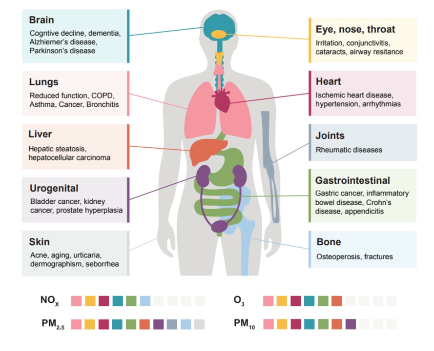{fig-alt="Effects of health on the body"}
:::

:::::

## Heating is becoming a dominant urban NO~x~ source

:::::: columns
::: {.column width="65%"}
Since 1990:

-   Energy generation NO~x~: **−92%**
-   Road transport NO~x~: **−85%**
-   Heating's *relative* share keeps growing
:::

:::: {.column .fragment width="35%"}
::: stat-block
**72 ± 17%**

of NO~x~ emissions within the BT Tower flux footprint in central London come from **heating buildings** [@cliff2025]
:::
::::
::::::

::: {.fragment}
So replacing combustion heating can help improve **air quality**, not just **climate**.
:::

::: notes
\~1.5 min (6:00). Coal went, the EURO standards and LEZs squeezed traffic. What's left in a city centre? Boilers. The Cliff et al. eddy-covariance result from the BT Tower is the striking one — nearly three quarters of NOx in that footprint is buildings being heated. Mention this is direct flux measurement, not inventory.
:::

## Heat pumps: electrifying heat 

::::::: columns
::: {.column .incremental width="65%"}
-   **Zero** NO~x~, CO, PM or CO~2~ at the point of use
-   Coefficients of performance of **300–500%**
-   Bonus co-benefit indoors: 1,777 UK deaths from CO poisoning, 2010–2020 [@ons2021carbon]
:::

::::: {.column width="35%"}

::: {style="width: 2em;"}

:::

::: {.stat-block .fragment}
**\>60%** of buildings in Norway have a heat pump

**\<1%** in the UK
:::
:::::
:::::::

::: notes
\~1.5 min (7:30). The Norway/UK contrast shows this is a policy and market problem, not a technology problem.
:::

## There are two different heat pump subsidy schemes

::: {style="display: flex; flex-direction: column; justify-content: space-between; height: 80%;"}
|   | **Boiler Upgrade Scheme (BUS)** | **Energy Company Obligation (ECO4)** |
|------------------------|------------------------|------------------------|
| Support | £7,500 grant | Up to full cost |
| Who qualifies? | Anyone with a valid EPC | Means-tested |
| Installations | \>79,000 | \>36,000 |

Targets: 600,000 installations/yr by 2028 → revised **down** to 450,000/yr by 2030.

**Our question:** the location of a heat pump is irrelevant for the climate — but not for air quality. *So where are they actually going?*
:::

::: notes
\~1.5 min (9:00). BUS = first-come-first-served grant, you find the residual \~£5k+ yourself. ECO = targeted at fuel poverty. Then pivot the talk on the final line — this is the research question. From here on: data and model.
:::

## Today's uptake is uneven - BUS

:::::: columns
::: {.column width="75%"}
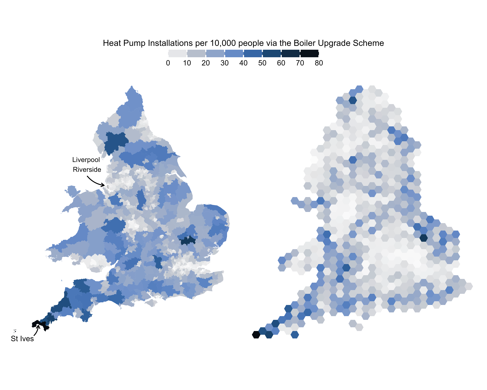{fig-alt="Map of BUS heat pump installations per 10,000 people by constituency"}
:::

:::: {.column .incremental width="25%"}
::: {style="height: 5em;"}
:::

-   St Ives: **77** per 10,000 people
-   Liverpool Riverside: **0.6** per 10,000 people
::::
::::::

::: notes
\~1.5 min (13:00). A two-orders-of-magnitude spread in uptake of the SAME national grant. Affluent, rural, detached-housing constituencies lead; urban, polluted ones trail. Uptake concentrates in the South West and East Anglia; cities lag — London, the North West, the West Midlands, South Wales
:::

## Today's uptake is uneven - ECO

:::::: columns
::: {.column width="75%"}
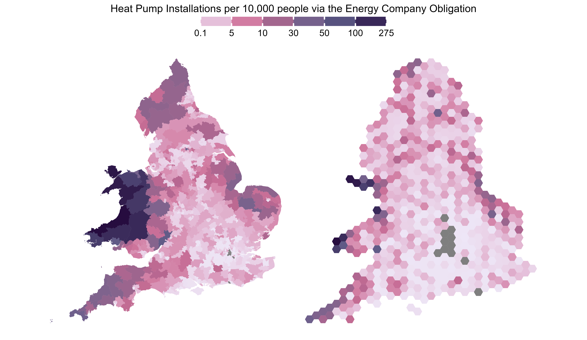{fig-alt="Map of ECO heat pump installations per 10,000 people by constituency"}
:::

:::: {.column .incremental width="25%"}
::: {style="height: 5em;"}
:::

-   Ceredigion Preseli : **274** per 10,000 people
-   **13** constituencies with 0
::::
::::::

::: notes
\~1.5 min (13:00). A two-orders-of-magnitude spread in uptake of the SAME national grant. Affluent, rural, detached-housing constituencies lead; urban, polluted ones trail. Uptake concentrates in the South West and East Anglia; cities lag — London, the North West, the West Midlands, South Wales
:::
## Higher pollution, fewer heat pumps

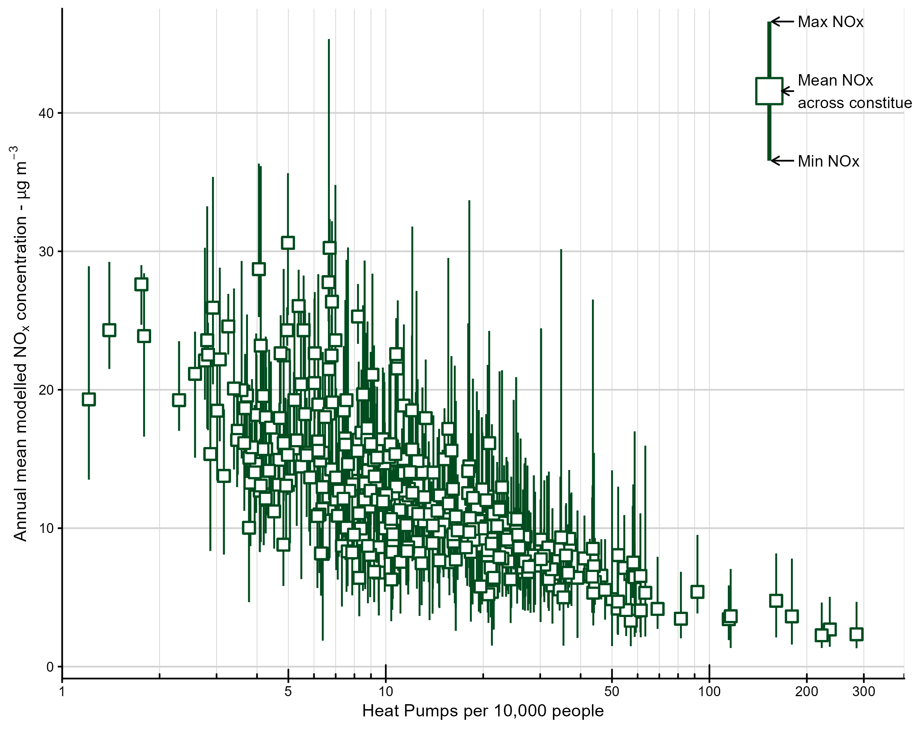{fig-alt="Heat pumps per 10,000 people versus annual mean NOx concentration, log scale" height="600"}

<!--The places with the most to gain are adopting the slowest — and Wales shows targeting *can* work (ECO via local authorities: 53 vs 3.4 per 10,000 in England).-->

::: notes
\~1.5 min (14:30). Figure 2 from the paper: per-capita uptake falls as ambient NOx rises. One bright spot: Welsh local authorities used ECO4 Flex referrals brilliantly — Ceredigion Preseli has 274 per 10,000. Proof that delivery mechanisms, not just money, drive equity.
:::

## Where will heat pumps be installed?

**Data: (at parliamentary constituency scale, 575 in England & Wales)**

::: {.incremental}
-   BUS + ECO installation statistics [@desnz_hpdeployment2024]
-   Heat pump suitability index [@nesta_hpsuitability2024]
-   NO~x~ emissions [@naei2024] 
-   Modelled NO~x~ background concentrations [@defra_pcm2024]
-   Deprivation (composite UK Index of Multiple Deprivation) [@parsons2021compositeimd]
:::

## Where will heat pumps be installed?

**Model:** allocate the Climate Change Committee's [-@ccc_balanced] projected installations (2025–2050) to constituencies each year with a multinomial draw with assigned probabilities under two scenarios: 

::::: {style="display: flex; flex-direction: column; justify-content: space-between; height: 80%;"}

:::::: columns

:::{.column width="45%"}
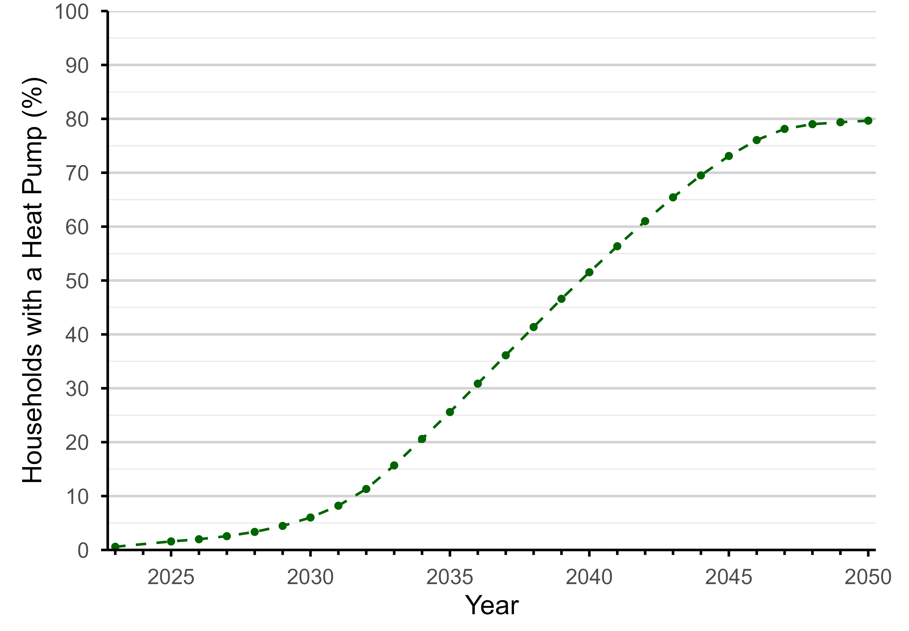
:::

::: {.column width="55%"}

::: {style="height:3em"}

:::

| Scenario                    | Heat pumps go where...                  |
|-----------------------------|-----------------------------------------|
| **Current trends continue** | ...BUS + ECO uptake                     |
| **Suitability-driven**      | ...buildings are technically most ready |
:::

:::::
:::::

::: notes
\~2.5 min (11:30). Keep methods brisk for a general audience. Three ingredients: where heat pumps go now, how dirty the air is, how deprived the area is. The model holds the NATIONAL total fixed (CCC Balanced Net Zero pathway) and only asks WHERE they land. Two probability weightings = two futures. Stress: we are not predicting adoption rates, only testing spatial allocation.
:::

## Project forward to 2050: who gets the clean air?

::::: columns

::: {.column .stack width="100%"}
:::: {.r-stack}
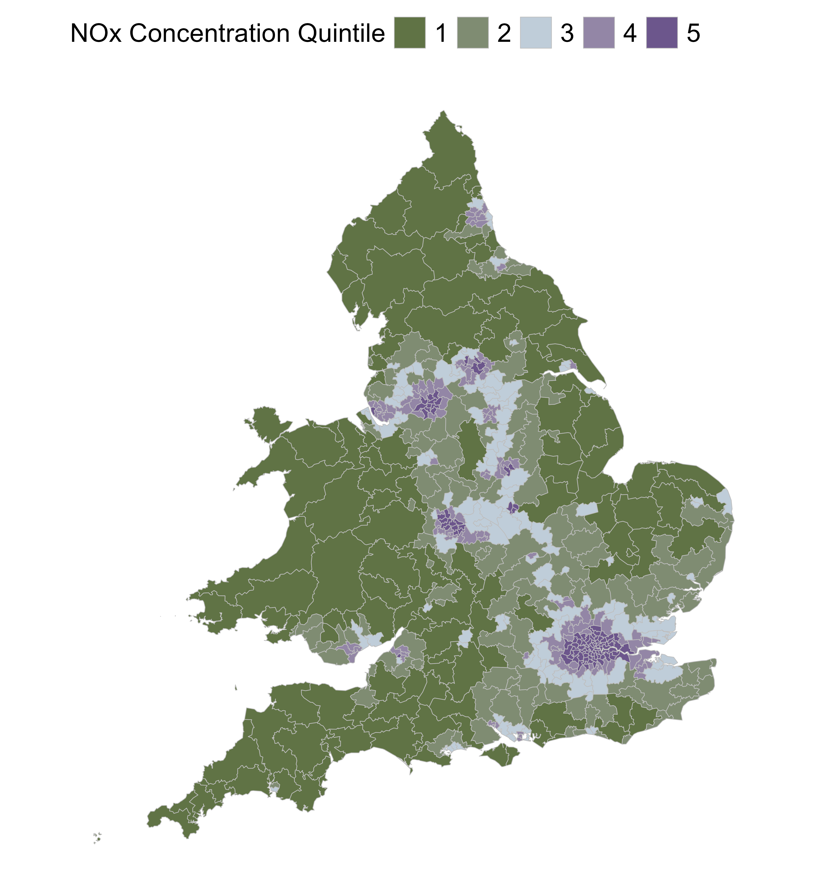{height="1200"}

::: {.fragment .fade-in}
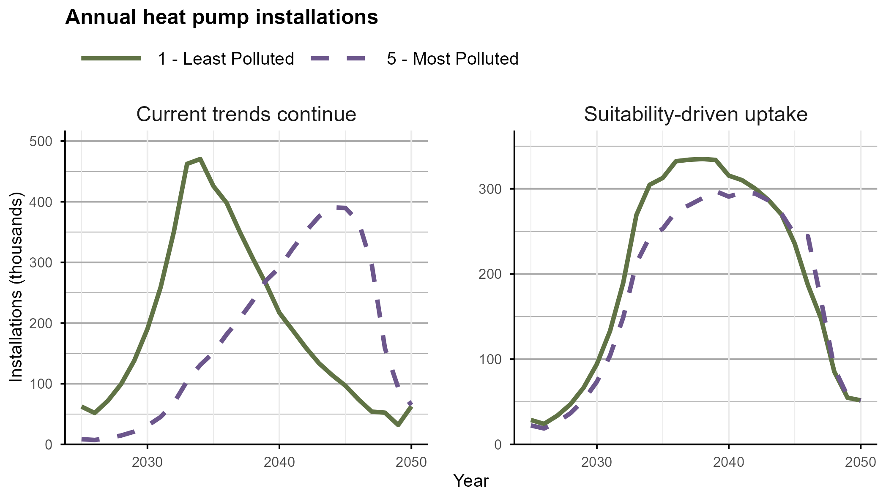{fig-alt="Installations, cumulative NOx savings and damage costs avoided by pollution quintile under both scenarios" height="720"}
:::

::: {.fragment .fade-in}
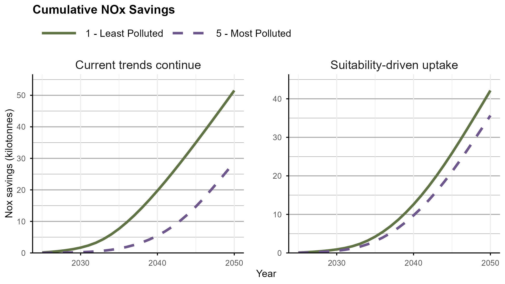{fig-alt="Installations, cumulative NOx savings and damage costs avoided by pollution quintile under both scenarios" height="720"}
:::

::: {.fragment .fade-in}
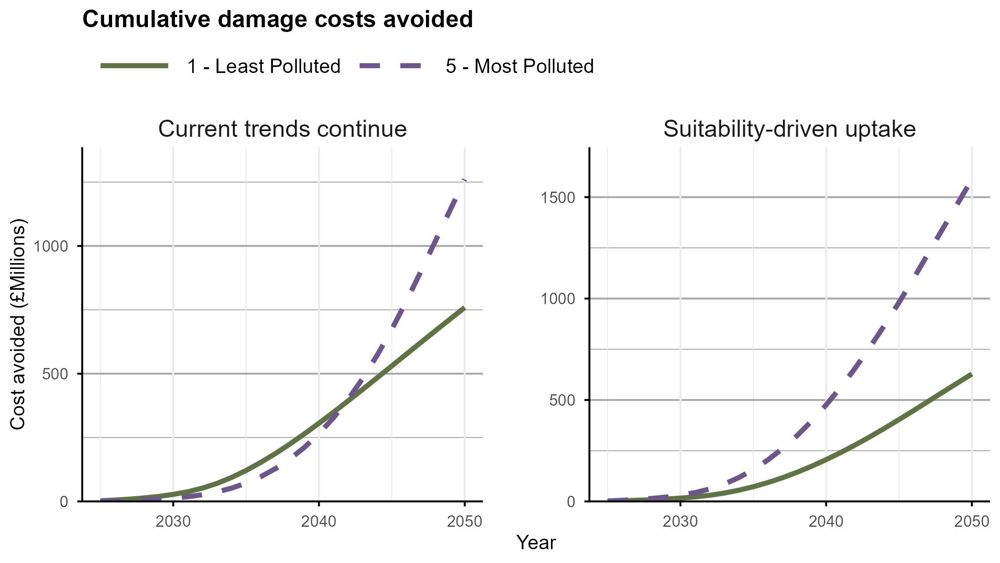{fig-alt="Installations, cumulative NOx savings and damage costs avoided by pollution quintile under both scenarios" height="720"}
:::

:::

::::

:::::

::: notes
\~2 min (16:30). Walk the three panels: installations peak in clean areas by 2034 but not until 2044 in polluted ones; cumulative savings 51.6 kt vs 29.2 kt. Under suitability-driven allocation the gap shrinks to \~19% — and monetised health benefits (damage costs, higher £/tonne in cities) actually flip to favour polluted areas sooner and reach £1.6bn there.
:::

## Inequality may get worse before any improvement

::: columns

::: {.column width="73%"}
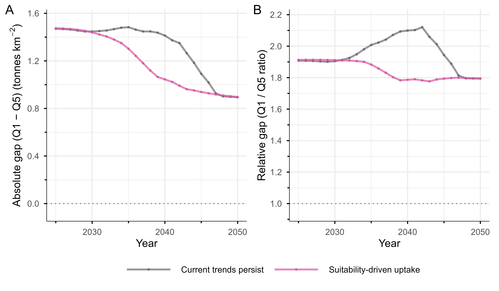{fig-alt="Absolute and relative NOx emission inequality between most and least deprived quintiles, two scenarios" height="720"}
:::

::: {.column width="27%"}
- Under current trends, **relative** emissions inequality between the most and least deprived stays elevated for \~20 years. 

::: {style="height: 1em;"}
:::

- Suitability-driven deployment reduces both absolute and relative inequality continuously.
:::

:::

::: notes
\~2 min (18:30). The grey lines are current trends, pink is suitability-driven (same colours as on the slide accents). Emissions fall everywhere eventually — the question is sequencing. Early adopters lock in compounding benefits because a heat pump is fixed and permanent: this is the "left behind" risk in one figure.
:::

## Will any of this even happen? 

::::: columns
::: {.column width="73%"}
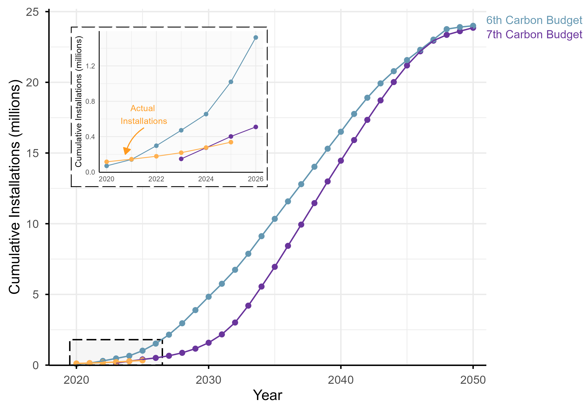{fig-alt="Cumulative installations: MCS actuals versus Sixth and Seventh Carbon Budget projections"}
:::

::: {.column width="27%"}
-   Actual installations to 2025: **\~337,000**
-   Seventh Carbon Budget expected: **400,000**
-   Sixth Carbon Budget expected: **\~1,000,000**

Our scenarios may be a **best case** — slower rollout stretches the inequality window further.
:::
:::::

::: notes
\~1 min (19:30 — running tight; this slide can compress to 30 s if needed). Ambition has already been revised down once. If deployment keeps undershooting, the convergence at the end of our model period never arrives.
:::

## Conclusions

::: incremental
1.  Domestic boilers are becoming a **dominant source of urban NO~x~** — heat pumps no emissions at the point of use
2.  Climate change doesn't care where a heat pump goes but it matters for **Air quality**
3.  Current subsidy design sends them to **affluent, already-clean** areas: 77% more NO~x~ benefit.
4.  Targeting by **air quality, deprivation and suitability** delivers more health benefit from the *same number* of heat pumps
:::

::: notes
\~1 min (20:30 with title — trim earlier slides slightly to land at 20:00). End on the policy-free framing chemists respond to: same chemistry, same hardware, same national total — the only variable is geography, and geography decides who breathes the benefit.
:::

## Thank you {.section-clean}

**Lucy Webster** \| WACL, University of York

Supervised by Ally Lewis & Sarah Moller.

::: small-print
Data & code: [github.com/lucy-web-0812/heat_pumps_AQ](https://github.com/lucy-web-0812/heat_pumps_AQ)
:::

::: {style="height: 5em;"}
:::

::: {style="text-align: center;" .fragment}
### Any Questions?
:::

::: {style="height: 5em;"}
:::

#### References

::: {#refs style="font-size: 50%;"}

:::
